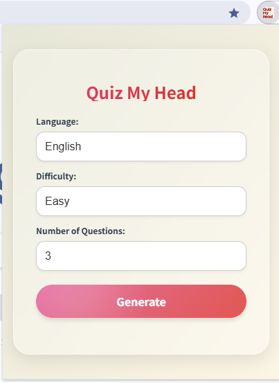

# QuizMyHead V1.1 - Gemini AI-Powered Reading Comprehension Assistant

QuizMyHead is a Chrome extension powered by Gemini AI, designed to help users enhance their self-study efficiency when learning from blogs or technical articles. It extracts the main content from web pages, generates relevant questions, scores user answers, and provides feedback. Users can also configure their own backend for better privacy and control.

> If you encounter an issue where the page content cannot be extracted, please refresh the page and try again after it has fully loaded.



## Features

- Extracts main content from webpages
- Automatically generates questions based on the article
- Scores and provides feedback on user answers
- Supports custom backend deployment for enhanced stability and privacy
- (June 28) Users can now use the reset button to clear the plugin page

## Installation

1. Clone or download this repository and unzip it.
2. Open Chrome and go to `chrome://extensions/`.
3. Enable "Developer Mode" (top right corner).
4. Click "Load unpacked" and select the project folder (the one containing `manifest.json`).
5. Once installed, click the extension icon in the toolbar to start using it.

## Backend Configuration (Recommended)

The extension uses a public backend by default, but you can deploy your own backend for improved performance and data privacy.

### 1. Deploy the Backend

The backend code is in the **server** repository (a lightweight backend suitable for Vercel deployment). You can use your own API key and deploy it to Vercel (recommended):

```bash
vercel deploy --prod
```

You may also deploy it on platforms such as Railway, Render, or Cloudflare Workers.

### 2. Obtain Backend URL

After deployment, you will receive a URL like `https://your-backend.vercel.app` (or a similar domain).

### 3. Update Plugin Configuration

Open `popup.js` or `gpt.js`, and replace the server URL with your deployed backend URL:

```js
const serverUrl = "https://your-backend.vercel.app/api/ask";
```

Save the file and reload the extension.

## Usage Instructions

After clicking the extension icon, the plugin will extract content from the current page and show the Q&A interface. You can:

- Read the automatically generated questions
- Submit your answers
- Receive scoring and feedback

## Developer Notes

This extension is built with **JavaScript**, using **React + Vite** for the frontend and **Node.js** for the backend, deployed on **Vercel** (customizable by users).
